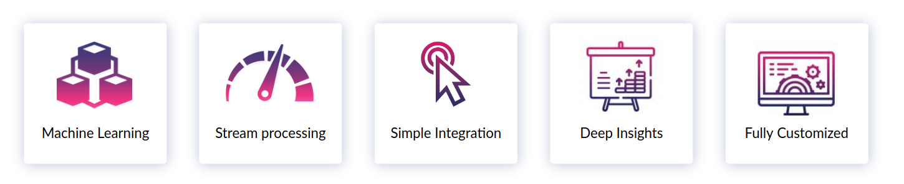
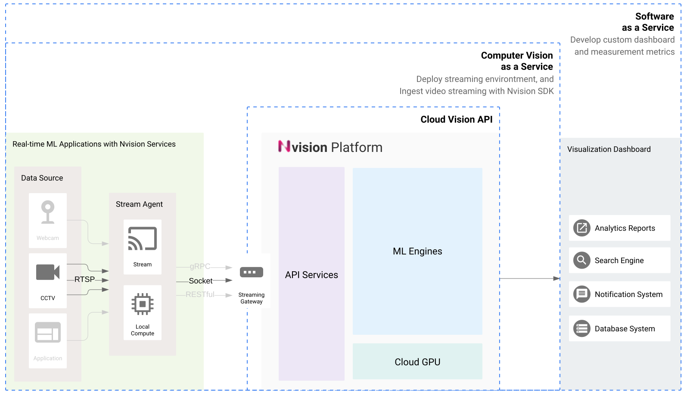

# Introduction

### What is the Nvision Service

Nvision enables machine learning services to extract insightful information from images with simple and easy to use APIs. Provide real-time video analysis with stream processing service. Get the most out of your visual information with the help of Nipa cloud experts. Offer fully customized algorithms to your specifications.

#### Vision-based solutions

* Is the ability of computers to acquire, analyze, and understand digital images and videos
* Using computer vision can help you extract a lot of information regarding the environment using just a simple camera.

#### Wide range of use

* Content discovery & Image search
* Retail analytics
* Facial analytics
* Visual Inspection

### Benefits

We make it easy to start, leverage and optimize machine learning at SCALE. Sending image data through our simple API calls and Receving predicitons in real-time.

#### **Machine Learning** 

Offer high-performance machine learning algorithms trained on huge datasets over a million images so that a machine is able to understand visual information as similar to humans, but in lighting speed and highly scalable.

#### **Stream Processing** 

Provide real-time image analysis with stream processing service. With edge SDK, we unable different API protocols that suit your application such as REST, RPC, and Socket.

#### **Simple Integration** 

With our flexible API protocols across REST, RPC, and Socket, integrating our machine learning services into your technology stack has never been easier. Ranging from edge applications to back-end services.

#### **Deep Insights** 

Suggesting machine learning use cases, Identifying key measurement metrics, turning your data into valuable insight, and getting the most out of your visual information with the help of Nipa cloud experts.

#### **Fully Customized** 

Offer fully customized algorithms to your specifications. Building a custom image preprocessing pipeline. Retraining and fine-tuning machine learning model with your data to recognizing new object categories, or advancing model architecture for even better accuracy.

### Service Tiers

#### **Nvision Platform**

* Custom image processing service
* Object Detection service

#### **Computer Vision as a Service**

* Surveillance camera server and Streaming environment setup
* Ingesting video streaming to the Cloud Vision APIs using SDK
* Developing Nvision process pipeline and Database system

#### **Software as a Service**

* Real-time monitoring dashboard
* Notification and Alert system
* Data Anaytics Reports

