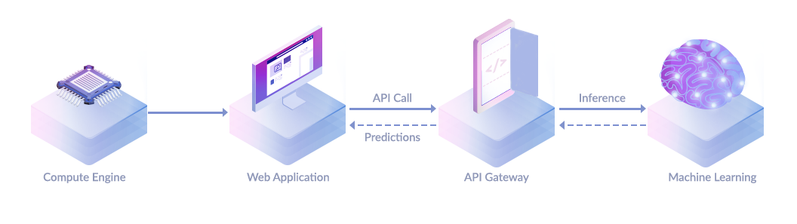

# RESTful Calls

Nvision cloud service provides two types of APIs. With our flexible API protocols across **RESTful** for synchronized **image** processing and **WebSocket** for real-time **video** analysis with a stream processing. Learn more, [what is Nvision service](https://nvision-docs.nipa.cloud/#what-is-the-nvision-api). Integrating our machine learning services into your technology stack has never been easier. Ranging from edge applications to back-end services.

Both image and video processing support the same API services which can detect and recognize labels with a wide range of categories. For more information about the Nvision services provided, see [machine learning services](https://nvision-docs.nipa.cloud/machine-learning-services).

### Nvision Image Processing <a id="nvision-image-processing"></a>

Nvision image processing is **synchronous**. The input requests and output responses are structured in JSON format. You can make a **RESTful API call** by sending an image as a **base64 encoded** **string** in the body of your request, see [make API calls](https://nvision-docs.nipa.cloud/quickstarts/make-a-restful-call) quickstart.



The API is built around a simple idea that you send an image input to the service and receives prediction results. The API is accessible via the domain, `https://nvision.nipa.cloud/api/<<service_name>>` over **HTTP** to **POST** data as an example cURL command below:

```bash
curl -X POST \                                        
-H 'Authorization: ApiKey '$YOUR_API_KEY \
-H 'Content-Type: application/json' \
-d '{"raw_data": <<BASE64_ENCODED_IMAGE>>}` \
https://nvision.nipa.cloud/api/<<service_name>>
```

We also provide Nipa Cloud SDKs to call Nvision API in your own language, see the [API Reference](https://nvision-docs.nipa.cloud/api-references/api-guide) in this guide covers calling Nvision API for JavaScript and Python.

