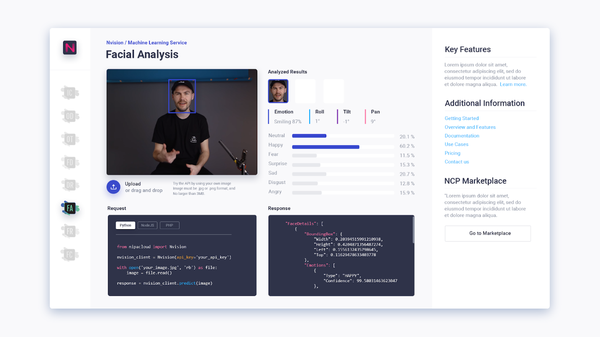

# Make a RESTful Call

Nvision image processing is **synchronous**. The input requests and output responses are structured in JSON format. You can make a **RESTful API call** by sending the image as a **base64 encoded** string in the body of your request, see [RESTful and WebSocket](https://nvision-docs.nipa.cloud/api-concepts/restful-calls) API concepts.  
  
You can make a RESTful API call by sending the image as a **base64 encoded** string in the body of your request. The API is accessible via the domain, `https://nvision.nipa.cloud/api/v1/<service_name>` over **HTTP** to **POST** data.


If you have not created a Nvision service account credentials, do so now in this [set up the Nvision service](https://nvision-docs.nipa.cloud/quickstarts/set-up-the-nvision-service) quickstart for instructions.


### Using cURL command line

Construct the request JSON body

```javascript
{
  "raw_data": <<BASE64_ENCODED_IMAGE>>
}
```

Send the request using the cURL command line

```bash
export API_KEY=<<YOUR_API_KEY>>
# read a local image from filepath
echo -n '{"raw_data": "'"$(base64 image.jpg)"'"}' | \
curl -X POST \
https://nvision.nipa.cloud/api/v1/object-detection \
-H 'Authorization: ApiKey '$API_KEY \
-H "Content-Type: application/json" \
-d @- | json_pp
```

#### Prediction reponses <a id="prediction-results"></a>

The API responses a list of labels with corresponding confidence scores of how likely it is these labels are contained within the image or video.

In object detection, this service localizes and identifies multiple objects in the image such as people, animals, vehicles, furniture, etc. see [machine learning services](https://nvision-docs.nipa.cloud/machine-learning-services).


A response is returned in JSON format similar to the following example:

```javascript
{
    "detected_objects": [
        {
            "confidence": 0.8327999711036682,
            "parent": "accessory",
            "bounding_box": {
                "left": 246,
                "right": 303,
                "top": 520,
                "bottom": 605
            },
            "name": "backpack"
        },
        ...
        {
            "confidence": 0.6195999979972839,
            "parent": "Object",
            "bounding_box": {
                "left": 595,
                "right": 641,
                "top": 64,
                "bottom": 230
            },
            "name": "traffic light"
        }
    ]
}
```

### Using web demo



