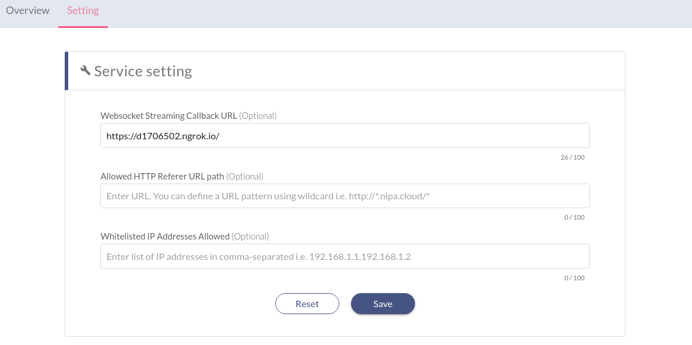

# Make a WebSocket Stream

WebSocket stream is another way to submit images to the Nvision service. To use the WebSocket stream, the easiest way is to use our provided SDK, see [JavaScript SDK](../api-references/javascript-sdk.md).


Consider using the WebSocket stream if you need to continuously submit images \(i.e., frames of the video stream\).


**To use Nvision with streaming videos,** your application needs to implement the following:

1. [Stream video frames to Nvision service](make-a-websocket-stream.md#stream-video-frames-to-nvision-service)**:** Develop websocket stream using SDK.
2. [Get results from the WebSocket via WebHook](make-a-websocket-stream.md#get-results-from-the-websocket-via-webhook): Create a webhook url to receive HTTP callback.
3. [Set up callback endpoints](make-a-websocket-stream.md#set-up-callback-endpoints): in the Nvision service page.

## Stream video frames to Nvision service


In this quickstart, we present an end-to-end use case of how to stream video frames from edge services and set up your backend service to receive the results.


Some application need to be run as a **Headless** agent on edge compute. For example, you develop a headless agent running on a RaspberryPi to read video frames from CCTV and submit them to the Nvision service as the following diagram.


### Installation

Initialize your NPM project, then install `@nipacloud/nvision` and `opencv4nodejs` using `npm` or `yarn` command.

```bash
yarn init
yarn add @nipacloud/nvision opencv4nodejs
```

### **Headless Agent**


```javascript
const OpenCV = require("opencv4nodejs");
const nvision = require("@nipacloud/nvision");
const objectdetectionStreamClient = nvision.objectDetection({
    streamingKey: "<YOUR_STREAMING_KEY>"
}).stream();

// display returned image if webhook is not set
objectdetectionStreamClient.on("message", (data) => {
    console.log("raw_data size:", data.raw_data.length);
    const img = OpenCV.imdecode(data.raw_data);
    OpenCV.imshow("visualization", img);
    OpenCV.waitKey(1);
});

objectdetectionStreamClient.on("sent", (bytesSent) => { 
    console.log("video frame sent: ", bytesSent, "bytes")
});

objectdetectionStreamClient.connect().then(() => {
    const cvCam = new OpenCV.VideoCapture(0);
    setInterval(() => {
        const cvCamFrameMat = cvCam.read();
        const jpgEncoded = OpenCV.imencode(".jpg", cvCamFrameMat);

        // make prediction request
        objectdetectionStreamClient.predict({
            rawData: new Uint8Array(jpgEncoded.buffer),
            confidenceThreshold: 0.1,
            outputCroppedImage: false,
            outputVisualizedImage: true
        })
    }, 1000);
});
```


## Get results from the WebSocket via **WebHook**

To get results, you need to configure a **Webhook** endpoint to your service**.** Webhook is a user-defined HTTP callback endpoint. 

### Installation



```bash
yarn init
yarn add koa koa-bodyparser
```



```
pip install Flask
```



**Headless Agent**




```javascript
const Koa = require("koa");
const bodyparser = require("koa-bodyparser");
const koa = new Koa();

koa.use(bodyparser());
koa.use((ctx) => { 
  console.log(ctx.request.body);
  ctx.status = 204;
});

koa.listen(3000);
```




```python
import json
from flask import Flask, request, jsonify

app = Flask(__name__)

@app.route('/', methods=['POST'])
def index():
    print(json.dumps(request.json, indent=2, sort_keys=True))
    return jsonify(success=True)

if __name__ == "__main__":
    app.run(host='0.0.0.0', port=3000)
```



**For testing webhook** integration, we use [ngrok](https://ngrok.com/) to create a **secure tunnel** on local machine along with public **URLs** **for exposing local web server**.



By running this  command `ngrok http 3000`, you will get **public URLs** as follows:


## Set up callback endpoints

As the socket protocol is used, we provide a custom **callback endpoint** configuration that allows you to have independent backends for receiving and analyzing prediction results.

**WebSocket Streaming Callback URL**

Now, input your exposed URL to the **WebSocket streaming callback URL** in service's setting.

```css
e.g. https://d1706502.ngrok.io/
```



Lastly, when the image is processed, the Nvision service will make a HTTP request to the specified endpoint with the prediction results structured as follow.

* **Method**: POST
* **Body**: The request body will be provided as


```javascript
{
    "detected_objects": [
        {
            "confidence": number,
            "parent": string,
            "bounding_box": {
                "left": number,
                "right": number,
                "top": number,
                "bottom": number
            },
            "name": string
        }
    ]
}
```


### Example output

Output Logs from Streaming agent \(left\) and Webhook callback \(right\)


