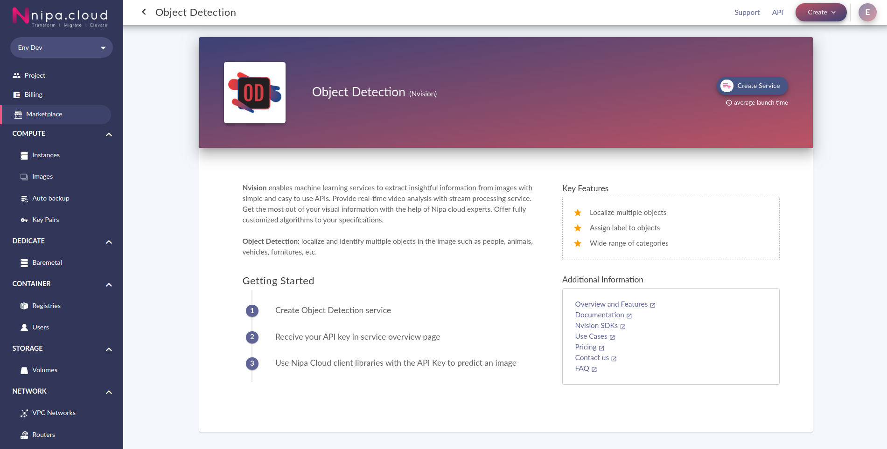
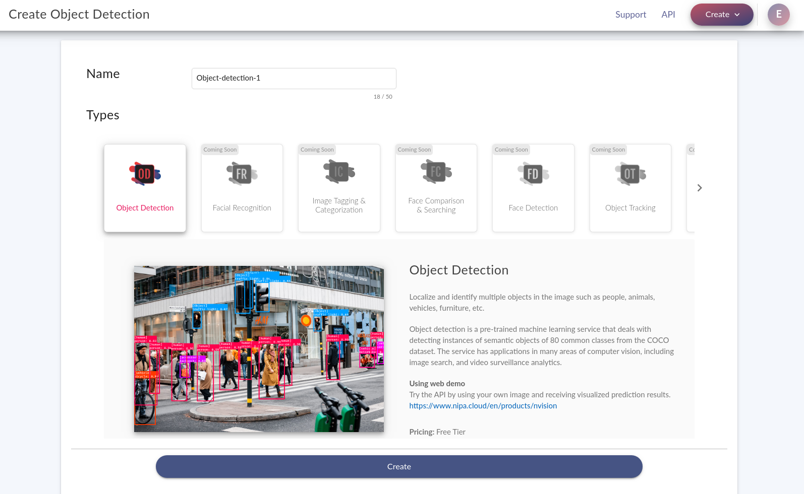

# Set up the Nvision Service

This tutorial provides steps to get you started using Nvision \(Nipa Cloud Vision API\) through a simple API call.


To use Nvision services, you must create a NCP project.


### Create a Nvision service

1. Open [http://portal.nipa.cloud/marketplace/](http://portal.nipa.cloud/marketplace/)
2. Go to Machine Learning category and Select a service to create
3. Define your **service name** and review the pricing tier of the service.

### Get the API key

In the overview page, you can view your API usage metrics and the service information including service id, quota info, and **API key**. ****Once your service has been started, see **generate** under **API Key** to get your service key.

