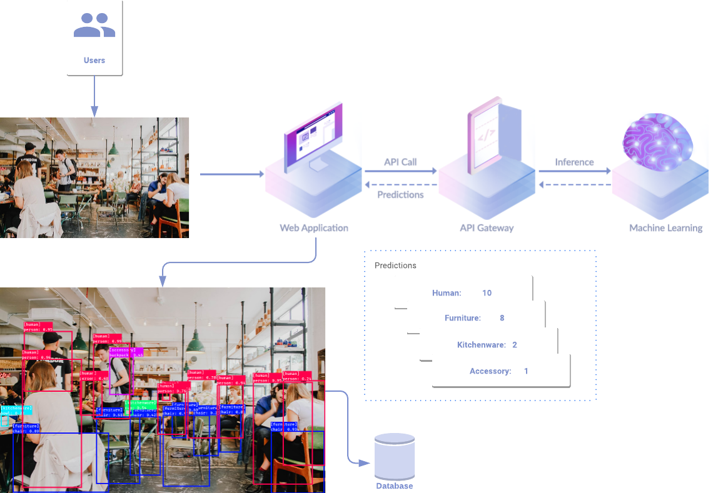
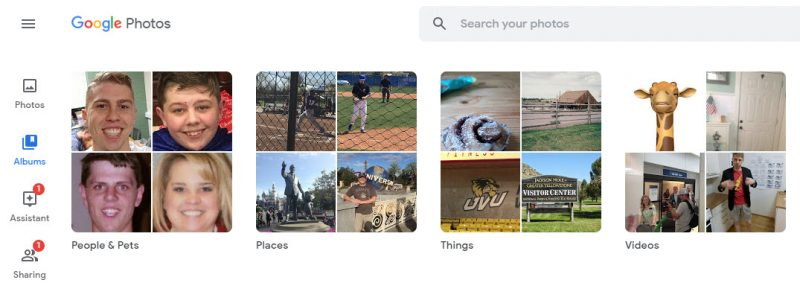
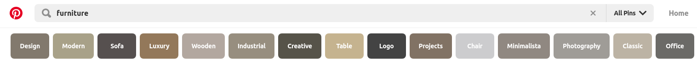

# Image Content Tagging

Nvision service makes it easy to create better experiences with better image understanding that allows you to extract image content and **make images searchable** for users. The image can be ranging from user-uploaded photos to marketing assests to graphical content. 

You can use Nvision to perform image tagging and categorization via standard REST API calls and you only pay for the number of images analyzed.


The idea is to get the most possible out of your images by indexing those images as easy to find through as text documents.


**Autogated Image Tagging using the Nvision service**

Using keywords tags for photo organization

### **Related use cases**

**From Google Photo**

**From Pinterest**

